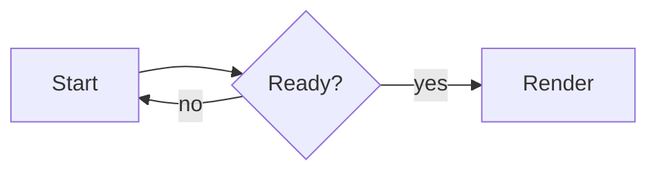

# visualization

A Claude Code plugin that renders diagrams and charts to PNG/SVG for use in
GitHub issues and pull requests, Claude Code responses, documentation, and
local files. Rendering runs locally and offline.

## Renderers

Supported now:

- mingrammer/diagrams — cloud and infrastructure architecture with vendor icons
- Mermaid — flowchart, sequence, state, ER, and class diagrams (via mermaidx)
- Matplotlib — line, bar, scatter, and other charts from a matplotlib script
- Graphviz DOT — graphs from the DOT language, rendered by the `dot` binary
- PlantUML — sequence, class, activity, and other UML diagrams (via the `plantuml` command)

## Installation

Add this repository as a plugin marketplace, then install the plugin, from
inside Claude Code:

```
/plugin marketplace add parsilver/visualization
/plugin install visualization@farzai
```

The marketplace name is `farzai` (declared in `.claude-plugin/marketplace.json`),
which differs from the repository name — install with `visualization@farzai`, not
`visualization@visualization`.

## Prerequisites

The `viz` CLI runs through [uv](https://docs.astral.sh/uv/), which is always
required and is not installed by the plugin. The other tools are needed only by
specific engines.

| Dependency        | Needed for                        | Install                                                             |
| ----------------- | --------------------------------- | ------------------------------------------------------------------- |
| uv                | always (runs the `viz` CLI)       | `brew install uv` or `curl -LsSf https://astral.sh/uv/install.sh \| sh` |
| Graphviz `dot`    | the diagrams and graphviz engines | `brew install graphviz`                                             |
| `plantuml` + Java | the plantuml engine               | `brew install plantuml`                                             |

The mermaid and matplotlib engines need no extra system binary — matplotlib
installs with the CLI's Python dependencies, and mermaid renders in pure Python.
The first render resolves ~60MB of Python dependencies through uv; later runs are
instant.

Each engine also checks its own dependencies at render time: if one is missing,
the command exits non-zero and prints the install command instead of reporting a
false success.

## Usage

Ask Claude to draw, diagram, or chart something and the `visualize` skill runs
the bundled `viz` CLI for you. It renders an engine's native source to a PNG or
SVG file, then hands back the path to embed or open.

Under the hood each render is one command. For example, a Mermaid diagram written
to `flow.mmd`:



renders to a PNG with:

```bash
uv run --project "${CLAUDE_PLUGIN_ROOT}/skills/visualize/scripts" \
  viz render --engine mermaid --input flow.mmd --format png --out flow.png
```

The command prints `{"engine", "format", "path"}` as JSON and writes the image to
`--out`, creating the output directory if it does not exist. `CLAUDE_PLUGIN_ROOT`
is set by Claude Code when the skill runs; to run `viz` by hand, point `--project`
at the installed plugin's `skills/visualize/scripts` directory instead.

Prefer PNG for portability: a diagrams SVG references its icons by local file
path and does not display correctly once moved to another machine, and some
Markdown renderers strip inline SVG. The mermaid, matplotlib, graphviz, and
plantuml engines produce self-contained SVG when you need vector output.

The skill at `skills/visualize/SKILL.md` documents the full workflow — which
engine to pick, each engine's source format, and delivering to GitHub, a Claude
response, or documentation. `skills/visualize/references/engines.md` documents the
engine contract.

## License

MIT — see [LICENSE](LICENSE).
